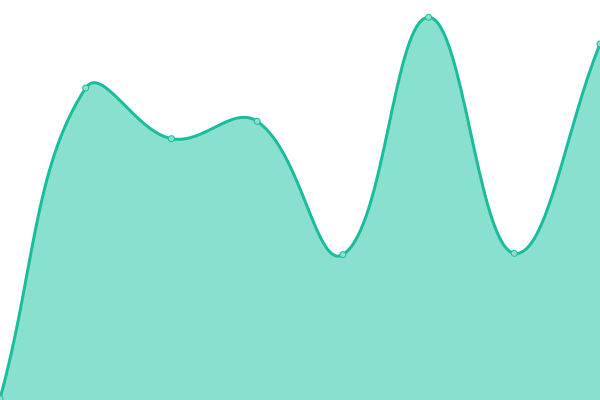

# [📈 Live Status](https://status.thing.press): <!--live status--> **🟧 Partial outage**

This repository contains the open-source uptime monitor and status page for [thing.press](https://thing.press), powered by [Upptime](https://github.com/upptime/upptime).

With [Upptime](https://upptime.js.org), you can get your own unlimited and free uptime monitor and status page, powered entirely by a GitHub repository. We use [Issues](https://github.com/thingpress/status/issues) as incident reports, [Actions](https://github.com/thingpress/status/actions) as uptime monitors, and [Pages](https://status.thing.press) for the status page.

<!--start: status pages-->
<!-- This summary is generated by Upptime (https://github.com/upptime/upptime) -->
<!-- Do not edit this manually, your changes will be overwritten -->
<!-- prettier-ignore -->
| URL | Status | History | Response Time | Uptime |
| --- | ------ | ------- | ------------- | ------ |
|  [Branza](https://thing.press/) | 🟩 Up | [branza.yml](https://github.com/thingpress/status/commits/HEAD/history/branza.yml) | 

 533ms
     
 | 

<a href="https://status.thing.press/history/branza">100.00%</a>
    

|  [Dashboard](https://my.thing.press/) | 🟩 Up | [dashboard.yml](https://github.com/thingpress/status/commits/HEAD/history/dashboard.yml) | 

 526ms
     
 | 

<a href="https://status.thing.press/history/dashboard">100.00%</a>
    

|  [Projects](https://projects.thing.press/) | 🟩 Up | [projects.yml](https://github.com/thingpress/status/commits/HEAD/history/projects.yml) | 

 414ms
     
 | 

<a href="https://status.thing.press/history/projects">98.58%</a>
    

|  [Honey](https://honey.thing.press/) | 🟥 Down | [honey.yml](https://github.com/thingpress/status/commits/HEAD/history/honey.yml) | 

 362ms
     
 | 

<a href="https://status.thing.press/history/honey">86.29%</a>
    

|  [Latte](https://latte.thing.press/) | 🟥 Down | [latte.yml](https://github.com/thingpress/status/commits/HEAD/history/latte.yml) | 

 320ms
     
 | 

<a href="https://status.thing.press/history/latte">86.30%</a>
    

<!--end: status pages-->

[**Visit our status website →**](https://status.thing.press)

## 📄 License

- Powered by: [Upptime](https://github.com/upptime/upptime)
- Code: [MIT](./LICENSE) © [thing.press](https://thing.press)
- Data in the `./history` directory: [Open Database License](https://opendatacommons.org/licenses/odbl/1-0/)
